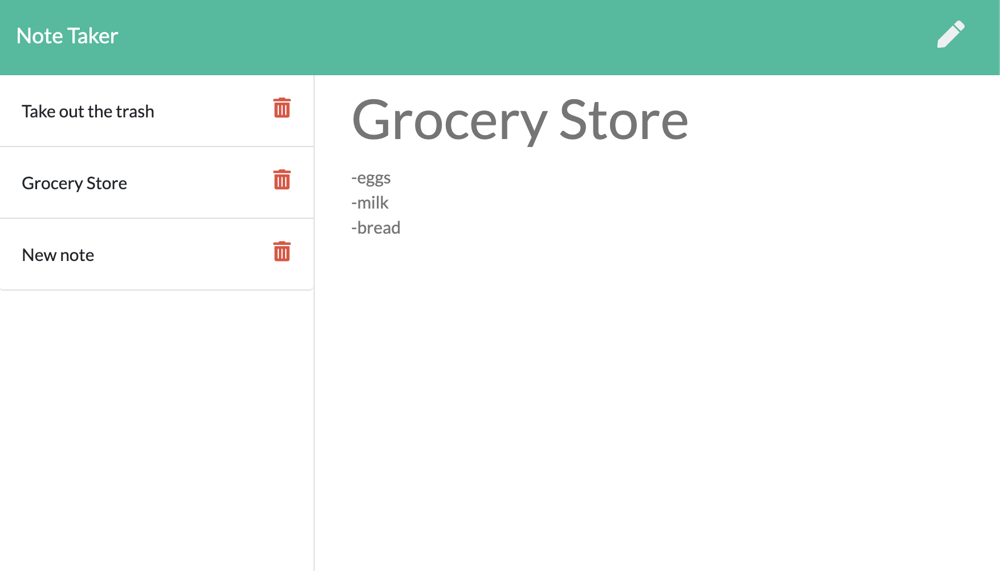

# Note Taking Application

## Description
Web based application for creating and saving notes. Give your note a title and some content, then hit the save button. Once saved, your notes will populate a list of titles to the left of the page. You can then click on a title and have the content of the note displayed on the page. 

## Links
Github Repository: https://github.com/thebsking/note-taker 

Deployed Application: https://cryptic-springs-08664.herokuapp.com/

## Screenshot

